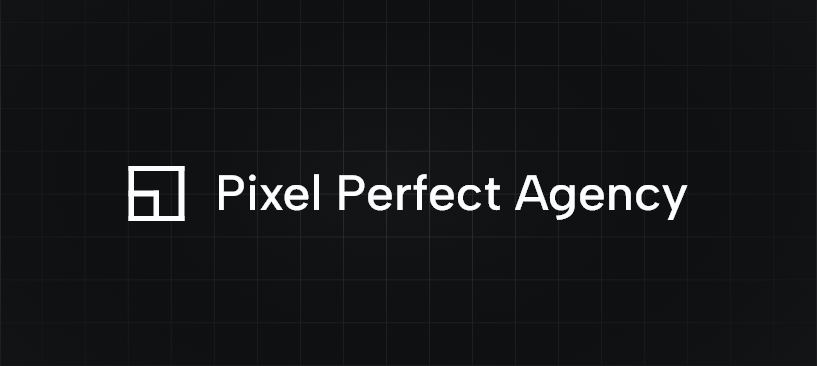

# Pixel Perfect Agency

Beautiful, fast, and safe software is what excites us. With our young team, we create web-based software (and everything around it) that helps businesses move forward and makes customers happy. We are innovative, efficient, and critical.

## Our technologies

### Frontend

We use the following technologies to create beautiful and fast web applications:

-   [Next.js](https://nextjs.org/)
-   [React](https://reactjs.org/)
-   [TypeScript](https://www.typescriptlang.org/)
-   [SCSS](https://sass-lang.com/)

This stack allows us to iterate quickly and deploy fast, interactive, typesafe web applications.

Next.js is the largest and fastest growing React framework. It is built on top of React and provides a lot of features out of the box, we don't want to worry about image optimization, font loading, and other performance optimizations. Next takes a lot of the heavy lifting out of our hands, so we can focus on what really matters: building great software.

We currently use SCSS as our CSS preprocessor, with the architecture we currently use it works quite well. We are evaluating Tailwind CSS as an alternative for new projects.

### Backend

Our backend framework of choice is Laravel. We use it to create robust REST APIs. The Laravel framework is very mature and has a large community.

-   [Laravel](https://laravel.com/)

## Open source

We are big fans of open source software. We believe that open source software is the future of software development. We are currently working on a few open source projects, which you can find on our [GitHub](https://github.com/orgs/pixel-perfect-agency/repositories) when they are released.

### [eslint-config-pixel](https://github.com/pixel-perfect-agency/eslint-config-pixel)

We created our own [ESLint](https://eslint.org) config to make sure we write consistent code. We use it in all our projects and we are happy to share it with the world.

```bash
npm install --save-dev eslint-config-pixel
```

### [stylelint-config-pixel](https://github.com/pixel-perfect-agency/stylelint-config-pixel)

We use [stylelint](https://stylelint.io) to make sure we write consistent SCSS code. We use it in all frontend and dashboard projects.

```bash
npm install --save-dev stylelint-config-pixel
```

## Team

Our team consists of young tech enthusiasts who are passionate about building great software.

-   [Willem-Jaap](https://github.com/Willem-Jaap)
-   [Frans](https://github.com/frans-slabbekoorn)
-   [Joan](https://github.com/JoanVerhulst)

## Contact

If you want to know more about us, or if you have a project that you want to discuss, feel free to take a look at our [website](https://pixelperfect.agency) or contact us at [pixelperfect.agency/contact](https://pixelperfect.agency/contact).
